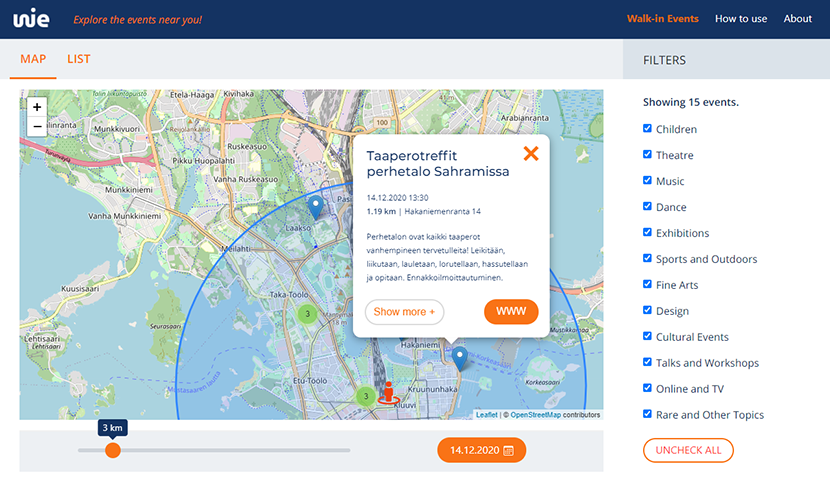
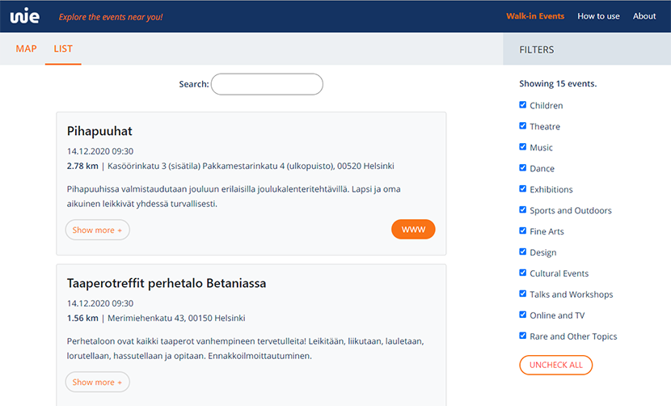

# Walk-in Events
### Explore the events near you!

Visit our [website](https://wie-dev.azurewebsites.net/)!

<p>

</p>

## Description

Walk-in Events was made to answers the question "What events in Helsinki could I go to right now?"

The project provides a way to view events from the [Helsinki Open API](http://open-api.myhelsinki.fi/) maintained by [Helsinki Marketing](https://www.myhelsinki.fi/en/about). Events are filtered and then displayed as markers on a map and as a list. The filters we use are: 

- time
- distance to user
- topictags
- name of the event

## Getting started

Follow these steps to run our application locally!

### Prerequisities

Be sure you are running node and npm on your computer.

Open command-line tool, f.e. powershell and type `node -v` and then `npm -v`


If you don't have node or npm installed on you computer just follow [these steps](https://nodejs.org/en/) and then come back!

### Installation

1. Clone
```
$ git clone https://github.com/Kapyjengi/WalkInEvents.git
```
2. Install npm packages in \WalkInEvents
```
$ npm install
```
3. Install npm packages in \WalkInEvents\react-front
```
$ npm install
$ npm install -g nodemon
```
4. Start node.js server and react frontend app in \WalkInEvents\react-front with one command
```
$ npm run dev
```
> Visit localhost:3001/api/events to be sure the the server is working correctly. React app is running in port 3000.

### Run tests
```
$ npm run test
```

## How to use our app?

On starting the application, it asks the location of the user. If the user grants access to the location information, then the application shows the location on a map. Otherwise the application will show the user on a default location, which is the center of Helsinki. By default the application will display events on a 3 km radius and today.



Our application has a number of ways for modifying the search results. Radius can be changed from the slider beneath the map, also the date picker is found underneath the map. There is also a sidebar for filters from which the different tags can be changed.

If the preliminary search parameters can't locate any events, use the mentioned filtering methods to find events. The events are shown in the map through pins. By clicking the pin, the selected event's information pops up.



All the events can be seen on the list tab as well as the map tab. There is a search bar on the list tab with which you can filter from the events shown by their names.

## Modifying the code to take other event data

The project takes JSON data from an open API. If you want to use this as a base for your own project, the data you use should have **at least** these fields: 

- Name/Description
- Location(coordinates, or use a geocoding tool with an address)
- Start time

For the lightest implementation, you could build a function that converts your data into our format in between it being fetched and being saved to redux-store. For each field you're lacking in your data, either disable the functionality in the code or generate empty fields.

### The structure of the relevant fields in the event-object we use from Helsinki-API:

```
{
    "name": {
        "fi": "<Finnish>", 
        "en": "<English>",
        "sv": "<Swedish>"
    },
    "info_url": "<Link to event organizers page>",
    "location": {
        "lat": 60,
        "long": 25,
        "street_address": "",
        "postal_code": "",
        "locality": ""
    },
    "description": {
        "intro": "<Title>",
        "body": ""
    },
    "tags": [
        {
            "name": "<Tag name, we use these for filtering>"
        }
    ],
    "event_dates": {
        "starting_day": "2020-11-07T12:00:00.000Z",
        "ending_day": "2020-11-07T12:00:00.000Z"
    }
}

```

The tag categories were made by hand and are hardcoded into LogicalFunctions/GetTagList.js. They probably won't be useful for your data, but you can use it as a base for your own division.

You'll find our data-fetch functions in the Services-folder. For changing the url you'll also need to edit "proxy"-field in package.json.

## Contact us

Please feel free to contact us if you need any further information!
<walkinevents.hki@gmail.com>

## Project group

- [Anton Javits](https://github.com/AntonJavits)
- [Petja Koivu](https://github.com/bgh312)
- [Olli Kuikka](https://github.com/pineappletea)
- [Sami Kulonpää](https://github.com/samikul)
- [Päivi Lampinen](https://github.com/PaiviL)
- [Jukka Lehikoinen](https://github.com/JukkaLehikoinen)

This project was part of Software Project II -course in Haaga-Helia University of Applied Sciences.


## Licence


Helsinki Open API [terms of use](http://open-api.myhelsinki.fi/terms).
